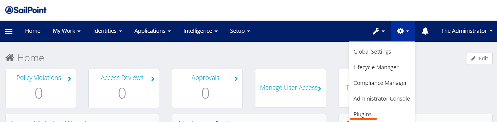

# IdentityIQ ITF plugin installation

* * *

1. First step is to deploy ITF plugin to your IdentityIQ instance (Most likely you will be starting with you local instance). Log in to your IdentityIQ and navigate to Plugins (Gear Icon → Plugins). You will need administrative capabilities to perform this action.
    
2. On the plugin page, select New. This will open Drag and Drop Panel. Using that panel, or by selecting a file using file explorer (if you click on upload file link), select ITF plugin zip file. This is the file described in #1 above (NOT the distribution zip file).
    
3. Once the plugin file is uploaded, the ITF plugin should be installed. You should see it on the plugin list. Note the plugin version, which should match the version indicated by the file name.
    
4. When downgrading ITF version, you will have to delete higher version first (please refer to IIQ Plugin documentation).
5. When upgrading ITF version, just install new version and it will be upgraded automatically.